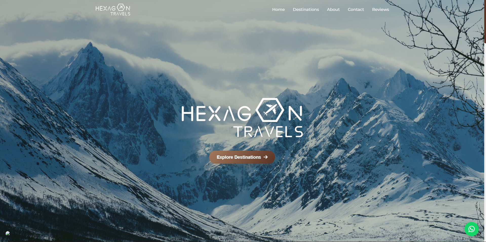

# Hexagon Travels

A responsive travel agency website built with vanilla HTML, CSS, and JavaScript.

**Live →** [hexagontravels.com](https://hexagontravels.com)

---



---

## Stack

- HTML · CSS · JavaScript
- Font Awesome 6 · Google Fonts (Montserrat)

## Getting Started

```bash
git clone https://github.com/HarshvardhanRawat/HexagonTravels-v2.git
cd HexagonTravels-v2
open index.html
```

No dependencies. No build step.

## Configuration

| What              | Where                                    |
| ----------------- | ---------------------------------------- |
| Destination cards | `index.html` → `.carousel-track`         |
| Stats counters    | `data-target` on `.stat-number` elements |
| Contact details   | `index.html` → `#contact`                |
| Customer reviews  | `index.html` → `#reviews`                |
| Hero images       | `assets/` → `.hero-slide` divs           |

## Acknowledgements

Designed & developed by [Harshvardhan Rawat](https://harshvardhanrawat.dev)
